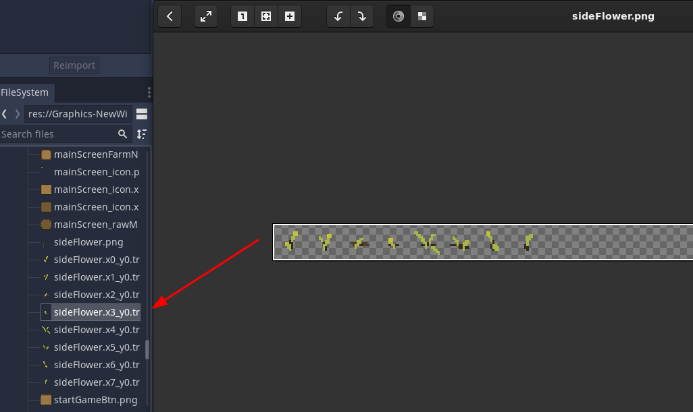
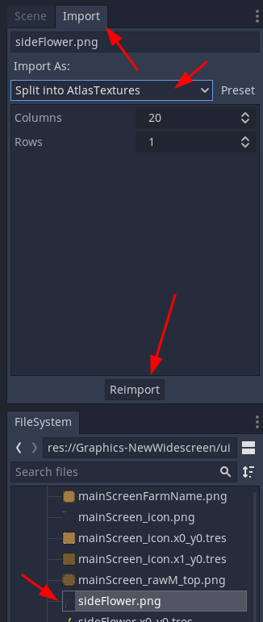

# gd-importsplitter-import

Godot Import Splitter (Import Module)

Take your sprite sheets, configure the Import, and have them split into AtlasTextures!

**Warning!** Please make sure to check if your intended usage supports AtlasTextures! Some objects do not support AtlasTextures and rendering this attempt to use them useless (some Animation nodes at the time of writing this, i.e. 3.4)

Straight forward: 
- Amount of Columns
- Amount of Rows
- Size will be automatically determined by image width divided by columns and image height divided by rows
- Empty (= same color across the entire slice) images will be discarded and delete
- naming is sourceFileName_x<#>_y<#>.ext

Questions? Find me on Godot Discord Server (or the german one).